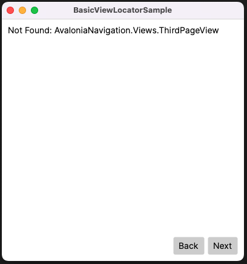

# Avalonia.Navigation

Simple project to use navigation in Avalonia 11 with CommunityToolkit.MVVM.

* Avalonia 11.0.2
* CommunityToolKit.MVVM 8.2.1
---

The OG implementation using ReactiveUI.
* https://github.com/AvaloniaUI/Avalonia.Samples/tree/main/src/Avalonia.Samples/Routing/BasicViewLocatorSample

---
With CommunityToolkit.MVVM

In this sample, the MainWindow.axaml changes the "CurrentPage", which is a UserControl within the MainWindow.

To change the view, we have two options: 
- ContentControl (Normal)
  https://docs.avaloniaui.net/docs/controls/contentcontrol

- TransitioningContentControl (With animation)
  https://docs.avaloniaui.net/docs/controls/transitioningcontentcontrol

```
    <Grid RowDefinitions="*,Auto" Margin="10">

        <!-- <ContentControl Content="{Binding CurrentPage}" /> -->
        <TransitioningContentControl Content="{Binding CurrentPage}" /> 
        
        <StackPanel Grid.Row="1" Orientation="Horizontal" Spacing="5" HorizontalAlignment="Right">
            
            <Button Command="{Binding NavigatePreviousCommand}" Content="Back" />
            <Button Command="{Binding NavigateNextCommand}" Content="Next" />
            
        </StackPanel>

    </Grid>
```

### Page 1:


### Page 2 Validation = false
##### We can't navigate to the next page until the validation is met.


### Page 2 Validation = true:


### Page 3 When there are no more pages, show a message.
